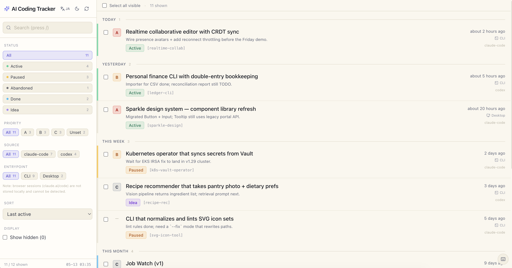
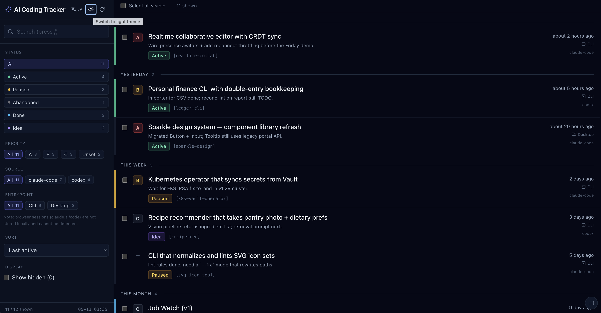
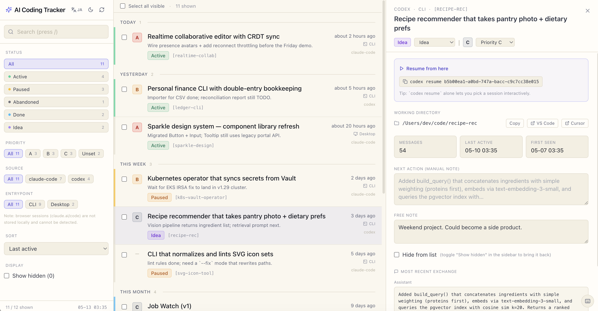
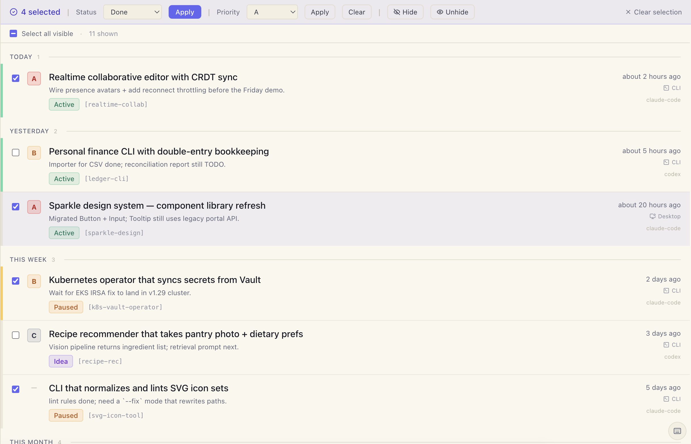
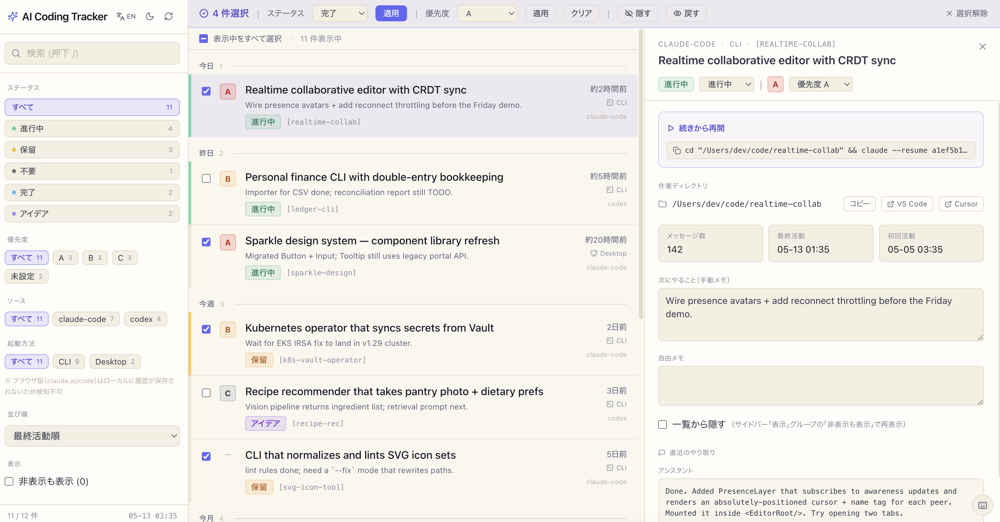

# AI Coding Tracker

A local-first web dashboard that auto-discovers your **Claude Code** and **Codex CLI** sessions, surfaces the last interaction and a "what's next" memo, and helps you revive abandoned projects.

> Read-only on your session history. The only files this tool writes to are inside `~/.ai-coding-tracker/`.

[日本語版はこちら](#日本語)



<details>
<summary>More screenshots (dark mode, detail panel, bulk actions, Japanese UI)</summary>

#### Dark mode


#### Detail panel — resume command, working directory, editable notes


#### Bulk actions — status / priority / hide across many sessions at once


#### Japanese UI (auto-detected from `navigator.language`, toggleable)


</details>

---

## Features

- Walks `~/.claude/projects/*/<sessionId>.jsonl` and `~/.codex/sessions/YYYY/MM/DD/rollout-*.jsonl` and groups them **one project row per session**.
- Auto-extracts a human-readable project label, the latest exchange (user + assistant), the most-recent working directory, and detects whether the session came from the CLI or the Desktop app.
- Status pipeline: **active / paused / abandoned / done / idea**, plus A/B/C priority.
- Manual notes: "next action" memo, free-form note, alias (display name), hide toggle.
- Sidebar filters (status / priority / source / entrypoint / search) with live counts.
- Date buckets in the list view (Today / Yesterday / This week / This month / Last 3 months / Older).
- Bulk operations via row checkboxes (status / priority / hide) with server-side write locking.
- Light / dark theme.
- **English & Japanese UI** — auto-detected from `navigator.language`, toggle in the header.
- Keyboard shortcuts: `/`, `j/k`, `1-5`, `a/b/c`, `h`, `Esc`.
- All user edits live in `~/.ai-coding-tracker/overrides.json` and are never overwritten by rescans.

## Requirements

- **Node.js 18.17+**
- A local install of **Claude Code CLI** and/or **Codex CLI** that writes session history under `$HOME`. Browser-only users of `claude.ai/code` are not supported (history lives in the cloud).
- macOS / Linux. Windows users are supported via manual `npm run dev` startup — the auto-start templates ship for macOS and Linux only.

## Install

```bash
git clone https://github.com/yuuuzooo/ai-coding-tracker.git
cd ai-coding-tracker
npm install
npm run dev          # http://127.0.0.1:5180/
```

The server binds to `127.0.0.1` only and writes its data files to `~/.ai-coding-tracker/`.

### One-shot scan from the CLI

```bash
npm run scan         # regenerate ~/.ai-coding-tracker/index.json
```

## Configuration (environment variables)

All paths default to `$HOME`-relative locations and can be overridden when sessions live elsewhere (e.g. WSL pointing at the Windows-side `.claude` directory, or a non-standard install).

| Variable | Default | Purpose |
|---|---|---|
| `AICT_CLAUDE_PROJECTS_DIR` | `~/.claude/projects` | Claude Code session history |
| `AICT_CODEX_DIR` | `~/.codex` | Codex CLI root |
| `AICT_CODEX_SESSIONS_DIR` | `~/.codex/sessions` | Codex rollout files |
| `AICT_DATA_DIR` | `~/.ai-coding-tracker` | Writable runtime data (cache + your edits) |

Example: WSL user reading Windows-side Claude Code history:

```bash
AICT_CLAUDE_PROJECTS_DIR=/mnt/c/Users/<you>/.claude/projects npm run dev
```

## Local HTTP API

| Method | Path | Purpose |
|---|---|---|
| GET | `/api/index` | Returns the latest scan result |
| GET | `/api/overrides` | Returns your edits |
| PUT | `/api/overrides/:id` | Upsert one project's edit |
| DELETE | `/api/overrides/:id` | Remove one project's edit |
| POST | `/api/overrides/bulk` | Upsert many at once |
| POST | `/api/rescan` | Trigger an immediate rescan |

Writes are restricted to `127.0.0.1` and (when the `Origin` header is present) to `http://127.0.0.1` / `http://localhost` origins. Request bodies are capped at 64 KB.

## Running as a background service

### macOS (LaunchAgent)

```bash
cp LaunchAgents/com.aict.ai-coding-tracker.plist.example \
   ~/Library/LaunchAgents/com.aict.ai-coding-tracker.plist

# Replace every __REPLACE_*__ placeholder with values for your machine
vi ~/Library/LaunchAgents/com.aict.ai-coding-tracker.plist

launchctl load ~/Library/LaunchAgents/com.aict.ai-coding-tracker.plist

# Status / port / logs
launchctl list | grep ai-coding-tracker
lsof -nP -iTCP:5180 -sTCP:LISTEN
tail -f /tmp/ai-coding-tracker.log /tmp/ai-coding-tracker.error.log

# Stop
launchctl unload ~/Library/LaunchAgents/com.aict.ai-coding-tracker.plist
```

### Linux (systemd --user)

```bash
mkdir -p ~/.config/systemd/user
cp systemd/ai-coding-tracker.service.example \
   ~/.config/systemd/user/ai-coding-tracker.service

# Replace every __REPLACE_*__ placeholder
$EDITOR ~/.config/systemd/user/ai-coding-tracker.service

systemctl --user daemon-reload
systemctl --user enable --now ai-coding-tracker.service

# Status / logs
systemctl --user status ai-coding-tracker
journalctl --user -u ai-coding-tracker -f
```

### Windows

No template ships yet. Run `npm run dev` manually, or use **Task Scheduler** / **PM2** to keep it alive. PRs welcome.

## Data layout

```
~/.ai-coding-tracker/
├── index.json            # Auto-generated scan result
├── overrides.json        # Your edits (status / notes / aliases)
└── overrides.json.tmp.*  # Atomic-write scratch files (auto-cleaned)
```

If `overrides.json` is ever corrupted (manual edit gone wrong, partial sync, etc.), the server quarantines it to `overrides.json.corrupt.<timestamp>` and refuses to write to avoid silently destroying your notes.

## Safety

- The tool **never writes to** `~/.claude/` or `~/.codex/`. All write operations (`writeFile`, `rename`, `mkdir`) target `~/.ai-coding-tracker/` only.
- No `unlink` / `rm` / `rmdir` / `child_process` calls anywhere in the codebase.
- Path traversal protection: API id parameters are matched against `^[A-Za-z0-9_-]+$` and never reach `path.join`.
- Symlinks under the source directories are skipped.

## Known limitations

- **Browser-only Claude (`claude.ai/code`) and Web-only Codex** users have no local session history — the dashboard will be empty.
- **Devcontainers / Docker / Remote SSH**: history lives on the host. Run the tracker on the same machine your sessions ran on, or mount the history directory.
- **WSL**: by default reads the Linux-side `$HOME/.claude`. Use `AICT_CLAUDE_PROJECTS_DIR` to point at `/mnt/c/Users/<you>/.claude/projects`.
- **Codex assistant transcripts** require the modern `~/.codex/sessions/.../rollout-*.jsonl` format. Older Codex versions that only emit `history.jsonl` will show empty assistant excerpts.
- **The scanner runs in-process** when you start the Vite dev server. The first scan on a large history takes a few seconds; subsequent rescans use the same code path.

## Tech stack

React 18 + TypeScript + Vite 5 + Tailwind CSS + Zustand + lucide-react + date-fns. The API runs as a Vite middleware (`configureServer`) so the whole thing is a single dev-server process.

## Contributing

Bug reports and PRs welcome at https://github.com/yuuuzooo/ai-coding-tracker/issues. The codebase is small (~1.5k LoC) and intentionally framework-light.

## License

MIT — see [LICENSE](LICENSE).

---

## 日本語

ClaudeCode と Codex CLI で始めた開発セッションを自動でリスト化し、最終やり取りと「次にやること」を一画面で管理するローカル Web アプリです。

### できること

- `~/.claude/projects/*/<sessionId>.jsonl` と `~/.codex/sessions/YYYY/MM/DD/rollout-*.jsonl` を走査し、**1 セッション = 1 行**で集約
- プロジェクト名・最終やり取り・最頻 cwd・起動経路（CLI/Desktop）を自動抽出
- ステータス管理（active / paused / abandoned / done / idea）+ A/B/C 優先度
- 手動メモ（next action / 自由メモ）、エイリアス、非表示トグル
- サイドバーで複数フィルタと検索、日付バケットでグルーピング
- 一括処理（チェックボックス選択 → ステータス・優先度・hidden を bulk 反映）
- ライト / ダークテーマ
- **英語 / 日本語の UI 切替**（ブラウザ言語で自動判定、ヘッダのトグルで上書き）
- キーボードショートカット
- 編集は `~/.ai-coding-tracker/overrides.json` に永続化、再スキャンで上書きされない

### 動作要件

- Node.js 18.17+
- Claude Code CLI または Codex CLI を $HOME 配下にセッション保存する形で利用していること
- macOS / Linux 推奨（Windows は手動 `npm run dev` で動作可、常駐テンプレは無し）

### インストールと起動

```bash
git clone https://github.com/yuuuzooo/ai-coding-tracker.git
cd ai-coding-tracker
npm install
npm run dev    # http://127.0.0.1:5180/
```

### パス上書き

セッションが標準位置に無い場合は環境変数で上書き可能:

| 変数 | デフォルト | 用途 |
|---|---|---|
| `AICT_CLAUDE_PROJECTS_DIR` | `~/.claude/projects` | Claude Code 履歴 |
| `AICT_CODEX_DIR` | `~/.codex` | Codex CLI ルート |
| `AICT_CODEX_SESSIONS_DIR` | `~/.codex/sessions` | Codex rollout |
| `AICT_DATA_DIR` | `~/.ai-coding-tracker` | ツールの書き込み先 |

### LaunchAgent / systemd

`LaunchAgents/com.aict.ai-coding-tracker.plist.example`（macOS）、`systemd/ai-coding-tracker.service.example`（Linux）をテンプレートとして同梱しています。`__REPLACE_*__` placeholder を自分の環境に書き換えてロードしてください。

### 安全性

- `~/.claude` / `~/.codex` には**一切書き込みません**（読み取り専用）
- 書き込みは `~/.ai-coding-tracker/` 配下のみ。`unlink` / `rm` / `child_process` の呼び出しはコードベース全体でゼロ
- 詳細はリポジトリの [Safety セクション](#safety) を参照

### ライセンス

MIT — [LICENSE](LICENSE) を参照
